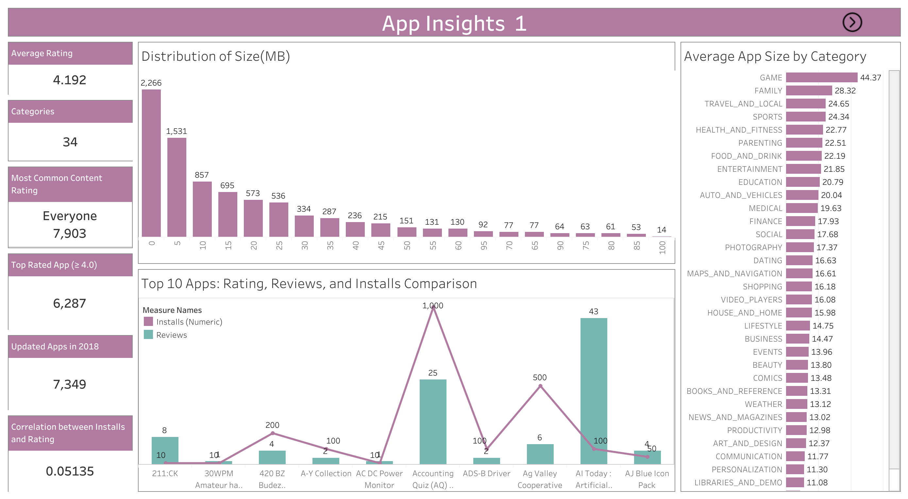

# App Insights – Tableau Dashboard

## Project Overview

**App Insights** is a Tableau data visualization project that analyzes mobile application data to identify trends in app ratings, installs, categories, reviews, pricing, and updates.

The dashboard helps in understanding:

* Popular app categories
* Relationship between installs and ratings
* Effect of app size on installs
* Rating distribution across content types
* App update trends

---

## Live Dashboard

View the interactive dashboard here:

https://public.tableau.com/views/AppInsights/AppInsights1?:language=en-US&publish=yes&:sid=&:redirect=auth&:display_count=n&:origin=viz_share_link

---

## Dataset Information

The dataset includes the following attributes:

* App Name
* Category
* Rating
* Reviews
* Number of Installs
* App Size
* Content Rating
* Free/Paid Type
* Last Updated Date

---

## Dashboard Features

* Average app rating analysis
* Top categories by total installs
* Correlation between installs and ratings
* App size distribution
* App update trends over time
* Comparison of highly reviewed apps
* Content rating distribution

---

## Dashboard Preview

---

## Tools Used

* Tableau Public
* Data Visualization
* Data Analysis

---

## Author

Bhargav Kumar

---

## Project Purpose

This project demonstrates data visualization and analytical skills using Tableau by transforming raw app data into meaningful insights.
